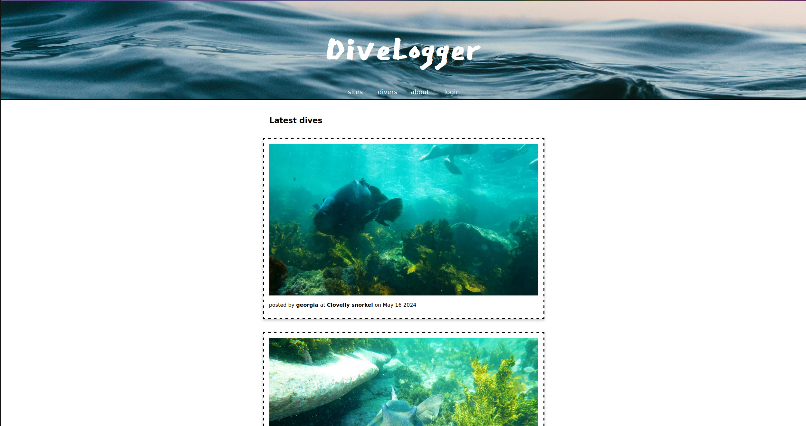

# divelogger

- a social media site for freedivers and snorkellers 

[DiveLogger on Render](https://snorkspotter.onrender.com/) 

()

## current features

- home feed with latest images

- add dive sites with location
- upload pictures of your dive to dive sites
- comment on dive sites
- favourite dive sites and access list of your favourites on your profile (link available permanently on header when logged in)

- delete images/comments
- remove a dive site from favourites

- view users
- view other users' images and favourites

- sign up for an account (if username/email not already registered)
- creating records only available if logged in

## tech used

- HTML/CSS
- Javascript
- Node
- Express, EJS
- SQL
- PostgreSQL
- Cloudinary
- Render

## future work

- admin approvals to add dive sites
- site tags e.g. accessibility, wildlife
- weather data for sites
- map data for sites allowing users to input location as a geocode and dive sites to be shown on map on homepage

